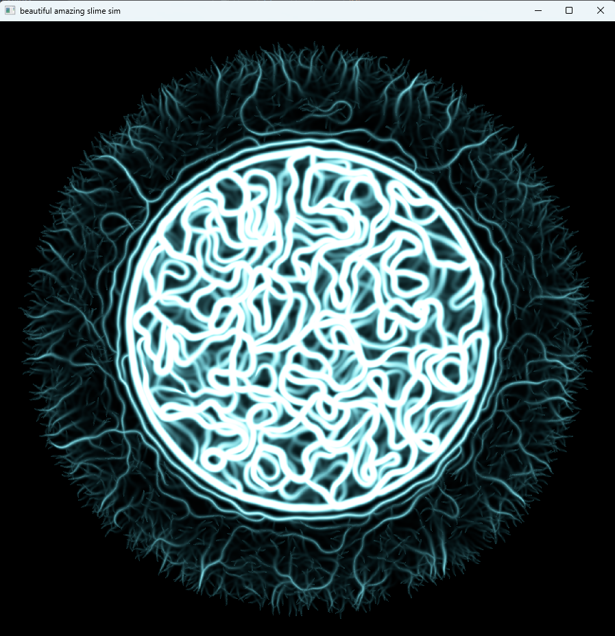

# physarium

A GPU slime mold simulation — ten million agents laying down and following
chemical trails, in Rust and wgpu. The emergent transport networks are the
Physarum polycephalum model from Jeff Jones' 2010 paper, run entirely on the
GPU.

<p align="center">
  
</p>

## Run it

```bash
cargo run --release
```

| Key | |
|---|---|
| `A` | overlay the agents on top of the trail map |
| `R` | re-seed the agents and wipe the trail |
| `Esc` | quit |

## How it works

Each agent is a position and a heading. Every frame it samples the trail map
at three points ahead of it, turns toward the strongest, moves, and deposits.
The trail map then blurs and decays. That is the whole algorithm — the
networks, the sheets, and the pruning back to a few thick veins all fall out
of those two rules interacting at scale.

Four passes per frame, with CPU involvement after startup:

| | |
|---|---|
| [`init.wgsl`](shaders/init.wgsl) | Seeds agents uniformly over a disc with random headings. Runs at startup and on reset. |
| [`compute.wgsl`](shaders/compute.wgsl) | Sense, steer, move, deposit. One invocation per agent. |
| [`diffuse.wgsl`](shaders/diffuse.wgsl) | Blur and decay the trail map. One invocation per cell. |
| [`trail.wgsl`](shaders/trail.wgsl) | Draws the map as a single world-space quad, colour-mapped in the fragment shader. |

The defaults are 10M agents over a 2048×2048 grid — about 2.4 agents per cell.
Much below 0.5 and the trails are too sparse to reinforce each other, so you
get wandering instead of networks; much above 4 and every cell saturates.

A few things that turned out to matter:

- **Seeding happens on the GPU.** Placing 10M agents CPU-side meant a 240 MB
  allocation, 20M calls into `rand`, and a PCIe upload before the window could
  appear. It is now one dispatch that never leaves the GPU.
- **Dispatches are 2D.** At `@workgroup_size(64)` a 1D dispatch caps out at
  65535 × 64 = 4,193,280 agents. Past that the dispatch is laid out as a rough
  square and the shader rebuilds the flat index from `gid.y * row_width + gid.x`.
- **The trail map is a storage buffer, not a texture**, so the fragment shader
  can read it directly — read-only storage is visible to every stage.
- **Diffusion is what makes it work at all.** Without it a sensor a few cells
  ahead almost never lands on a cell another agent happened to touch, and no
  structure forms.
- **Shaders fail soft.** A WGSL file missing its entry point degrades to "that
  pass does nothing" plus a message, rather than a validation panic that takes
  the window down with it.

## Notes

Written offline, which shaped some of the setup: every dependency is pinned to
an exact version, and the notes below stand in for the documentation I could
not look up.

| | |
|---|---|
| [01-what-can-read-write-what.md](docs/01-what-can-read-write-what.md) | Address spaces, the buffer/texture binding matrix, usage flags, atomics, and what is ordered relative to what. |
| [02-slime-mold-architecture.md](docs/02-slime-mold-architecture.md) | The algorithm in full, working parameter values, resource layout, and dispatch shapes. |
| [03-wgpu-29-api-deltas.md](docs/03-wgpu-29-api-deltas.md) | What changed in wgpu 29 / egui 0.35 / glam 0.33, plus macOS/Metal notes. |
| [04-offline-workflow.md](docs/04-offline-workflow.md) | Building without a network, and how to vendor the dependency tree if you want to. |
| [05-compiling-and-running.md](docs/05-compiling-and-running.md) | Cargo for this project: profiles, env vars, build times, reading error output. |

The load-bearing pin is `wgpu = "=29.0.4"` — egui-wgpu 0.35 depends on
`wgpu ^29.0`, so bump both or neither.

## Layout

```
src/lib.rs           GPU context, camera, Sim, Renderer
src/main.rs          window, event loop, tuning constants
shaders/             the four passes, plus the agent billboards
docs/                notes
```

Licensed under either of

- Apache License, Version 2.0 ([LICENSE-APACHE](LICENSE-APACHE) or
  http://www.apache.org/licenses/LICENSE-2.0)
- MIT license ([LICENSE-MIT](LICENSE-MIT) or
  http://opensource.org/licenses/MIT)

at your option.

## Contribution

Unless you explicitly state otherwise, any contribution intentionally
submitted for inclusion in the work by you, as defined in the Apache-2.0
license, shall be dual licensed as above, without any additional terms
or conditions.
